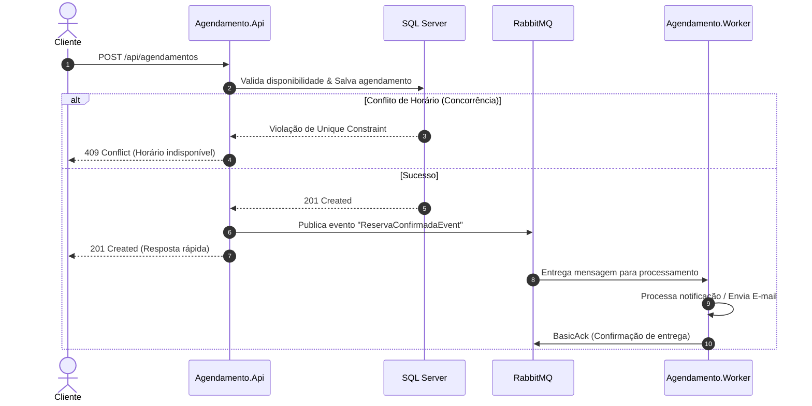

# 📅 Agendamento API com Fila de Notificações (RabbitMQ + .NET 8)

> API RESTful para agendamento de serviços com processamento assíncrono de notificações via mensageria, controle de concorrência e ambiente 100% containerizado com Docker Compose.

## 📌 Visão Geral do Projeto

O objetivo deste projeto é demonstrar a resolução de problemas reais de engenharia de software no ecossistema backend:
1. **Comunicação Assíncrona e Resiliência**: Ao confirmar uma reserva, a API persiste os dados e delega o envio de notificações (como confirmação por e-mail) a uma fila, liberando a resposta HTTP em milissegundos sem bloquear o cliente.
2. **Tratamento de Concorrência**: Prevenção ativa de agendamentos duplicados para o mesmo profissional/recurso no mesmo intervalo de tempo.
3. **Arquitetura Desacoplada**: Separação clara entre a API pública e o consumidor de segundo plano (*Background Worker*).


## 🏗️ Arquitetura e Fluxo de Dados

A solução segue os princípios da **Clean Architecture** (Arquitetura em Camadas) e padrão orientado a eventos (*Event-Driven Architecture*):




🛠️ Tecnologias e Ferramentas
Linguagem & Framework: C# / .NET 8 (ASP.NET Core Web API + Worker Service)

Mensageria: RabbitMQ (RabbitMQ.Client / MassTransit)

Banco de Dados: Microsoft SQL Server com Entity Framework Core

Containerização: Docker & Docker Compose

Documentação: Swagger / OpenAPI

📂 Estrutura da Solution
```AgendamentoSolution/
├── src/
│   ├── Agendamento.Domain/          # Entidades de domínio e regras de negócio
│   ├── Agendamento.Application/     # Casos de uso, DTOs e Interfaces
│   ├── Agendamento.Infrastructure/  # DbContext, Migrations e Client RabbitMQ
│   ├── Agendamento.Api/             # Controllers, Middlewares e Injeção de Dependência
│   └── Agendamento.Worker/          # Background Worker (Consumer da fila RabbitMQ)
├── docker-compose.yml               # Orquestração dos containers (API, Worker, SQL Server, RabbitMQ)
└── README.md```


🔒 Tratamento de Concorrência
Para garantir que dois clientes não consigam reservar o mesmo profissional no mesmo horário:

Índice Único Composto (Unique Index): Configurado via Fluent API no EF Core sobre as colunas ProfissionalId e DataHoraInicio.

Tratamento de Exceções de Integridade: Tentativas de inserção simultânea para o mesmo slot geram uma violação de chave única no banco de dados, sendo interceptadas pela camada de aplicação e convertidas em uma resposta HTTP 409 Conflict.

🚀 Como Executar o Projeto
Graças à containerização completa, você não precisa ter SQL Server ou RabbitMQ instalados localmente.

Pré-requisitos
Docker e Docker Compose instalados.

.NET 8 SDK (opcional, apenas se for rodar fora dos containers).

1. Clonar o repositório
Bash
git clone [https://github.com/monica308/agendamento-api-mensageria.git](https://github.com/monica308/agendamento-api-mensageria.git)
cd agendamento-api-mensageria
2. Subir todo o ambiente com Docker Compose
Bash
docker compose up --build -d
Esse comando inicializa:

SQL Server: porta 1433 (com migrations aplicadas automaticamente).

RabbitMQ Server: porta 5672 (com painel de gerenciamento na porta 15672).

Agendamento.Api: porta 5000 (ou 8080).

Agendamento.Worker: rodando em background consumindo as mensagens da fila.

 🧪 Testando e Monitorando
Swagger (Documentação da API)
Acesse a interface interativa da API no navegador:

http://localhost:5000/swagger
Painel do RabbitMQ (Management Dashboard)
Monitore a criação das filas, consumo de mensagens e taxa de entrega:

URL: http://localhost:15672

Usuário: guest

Senha: guest

Exemplo de Requisição (Criar Agendamento)
POST /api/agendamentos

JSON
{
  "clienteNome": "Maria Silva",
  "clienteEmail": "maria.silva@email.com",
  "profissionalId": "3fa85f64-5717-4562-b3fc-2c963f66afa6",
  "dataHoraInicio": "2026-09-01T14:00:00Z",
  "dataHoraFim": "2026-09-01T15:00:00Z"
}
